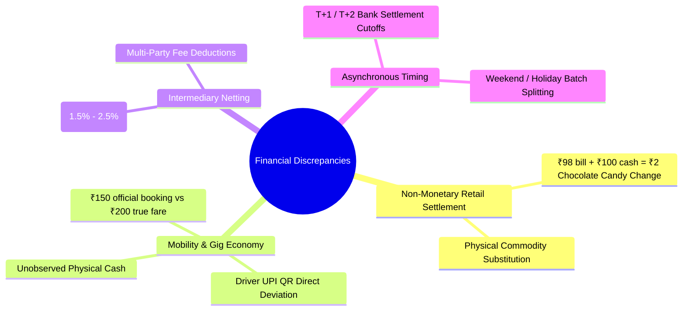
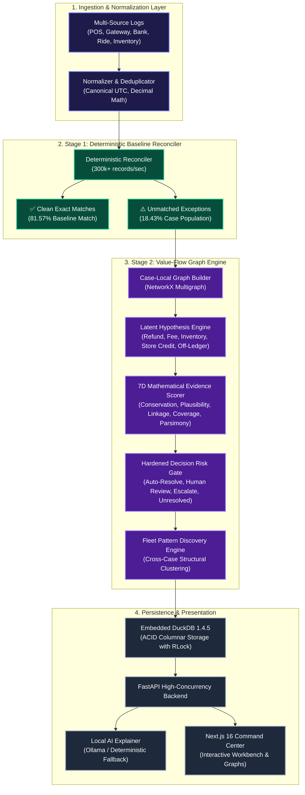
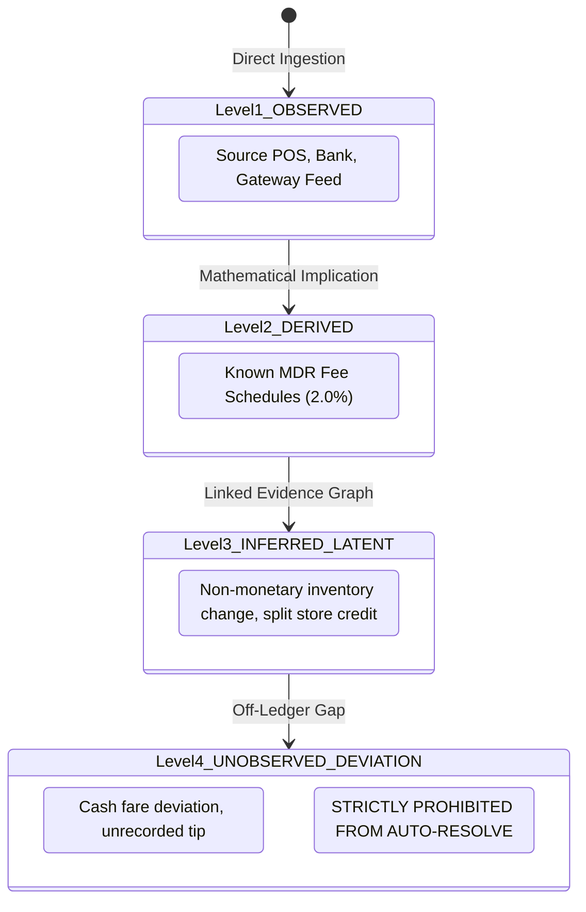
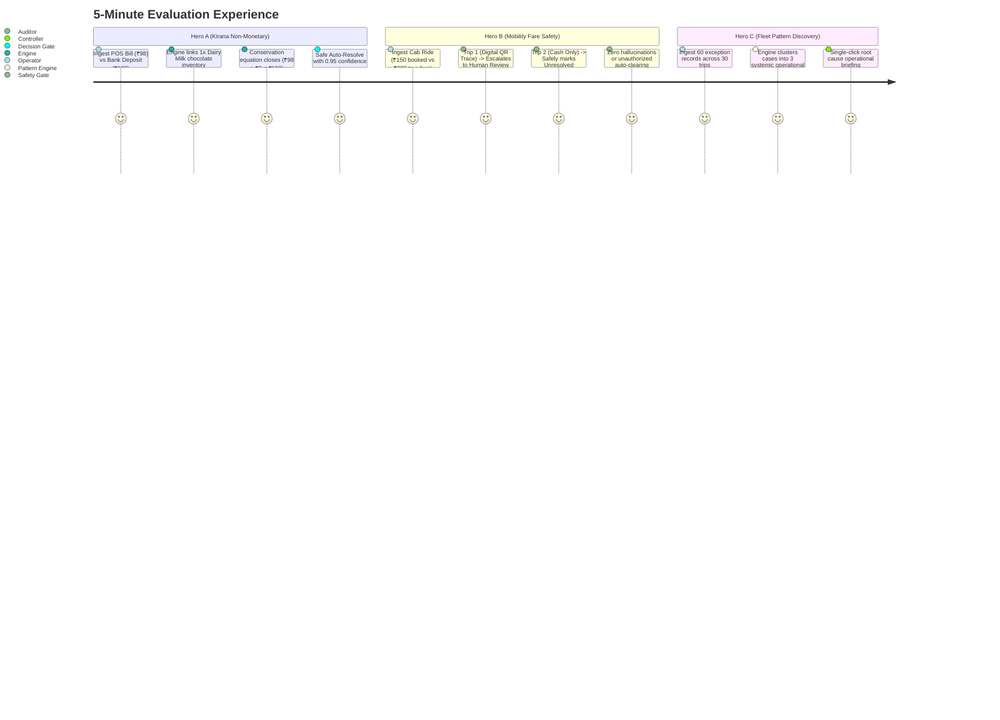

<div align="center">

# ⚡ ShadowLedger

### **Uncertainty-Aware Value-Flow Reconstruction Engine for Autonomous Finance Operations**

[](https://github.com/Nishant-codess/ShadowLedger)
[](https://github.com/Nishant-codess/ShadowLedger)
[-brightgreen?style=for-the-badge&logo=github-actions)](https://github.com/Nishant-codess/ShadowLedger/actions)

<p align="center">
  
  
  
  
  
  
  
  
  
</p>

<p align="center">
  <a href="#-quick-tour--5-minute-demo">🎯 <b>5-Min Demo</b></a> •
  <a href="#-authoritative-10000-record-benchmark-results">📊 <b>Benchmark</b></a> •
  <a href="#-system-architecture">🏗️ <b>Architecture</b></a> •
  <a href="#-complete-documentation-hub">📚 <b>Documentation Hub</b></a> •
  <a href="#-quickstart--local-setup">⚡ <b>Quickstart</b></a>
</p>

</div>

---

## 📚 Complete Documentation Hub

Explore the exhaustive engineering, academic, architecture, and operational specifications:

<table>
  <tr>
    <td width="50%">
      <a href="./docs/PRD.md">
        <h3>📋 Product Requirements (PRD)</h3>
      </a>
      <p>Problem statement, user personas (Controller, Analyst, Auditor), user stories, acceptance criteria, and non-goals.</p>
      <span style="color:#10B981">● <b>Status:</b> Approved</span> &bull; 
      <span style="color:#6366F1">● <b>Format:</b> IEEE Product Spec</span>
    </td>
    <td width="50%">
      <a href="./docs/SYSTEM_ARCHITECTURE.md">
        <h3>🏗️ System Architecture & REST APIs</h3>
      </a>
      <p>7-stage value-flow pipeline, C4 diagrams, concurrency locks, complete REST API specs with JSON payloads & cURL examples.</p>
      <span style="color:#10B981">● <b>Endpoints:</b> 8 Complete Routes</span> &bull; 
      <span style="color:#06B6D4">● <b>Local-First</b></span>
    </td>
  </tr>
  <tr>
    <td width="50%">
      <a href="./docs/DATABASE_SCHEMA.md">
        <h3>🗄️ Database Schema & Storage</h3>
      </a>
      <p>Embedded DuckDB 1.4.5 architecture, Mermaid ER diagrams, SQL DDLs, index strategies, and ACID thread-safety guarantees.</p>
      <span style="color:#F59E0B">● <b>Engine:</b> Embedded DuckDB</span> &bull; 
      <span style="color:#10B981">● <b>Thread-Safe (RLock)</b></span>
    </td>
    <td width="50%">
      <a href="./docs/ENGINEERING_DECISIONS.md">
        <h3>🏛️ Architecture Decision Records (ADRs)</h3>
      </a>
      <p>7 ADRs detailing technical tradeoffs: Zero-paid APIs, DuckDB vs Postgres, 4-level taxonomy, and dual-ledger separation.</p>
      <span style="color:#8B5CF6">● <b>7 ADRs Documented</b></span> &bull; 
      <span style="color:#10B981">● <b>Production Frozen</b></span>
    </td>
  </tr>
  <tr>
    <td width="50%">
      <a href="./docs/ACADEMIC_RESEARCH_REPORT.md">
        <h3>🎓 Academic Thesis & Theory</h3>
      </a>
      <p>Literature review, mathematical multigraph formulation $G=(V,E)$, value conservation laws, and APA 7th citations.</p>
      <span style="color:#EC4899">● <b>Theoretical Rigor</b></span> &bull; 
      <span style="color:#6366F1">● <b>Applied Graph Theory</b></span>
    </td>
    <td width="50%">
      <a href="./docs/USER_MANUAL.md">
        <h3>📖 Operator & User Manual</h3>
      </a>
      <p>Step-by-step investigation guide, value-flow visualizer navigation, decision playbook, and operational FAQ.</p>
      <span style="color:#06B6D4">● <b>Operations Guide</b></span> &bull; 
      <span style="color:#10B981">● <b>Non-Technical Ready</b></span>
    </td>
  </tr>
  <tr>
    <td colspan="2">
      <a href="./docs/TEST_PLAN_AND_RESULTS.md">
        <h3>🧪 Software Test Plan, Verification & Audit Results</h3>
      </a>
      <p>IEEE 829 test strategy, 59 unit/concurrency tests, 7 adversarial attack vectors, and 10,000-record ground-truth benchmark audit.</p>
      <span style="color:#10B981">● <b>59 / 59 Tests Passed</b></span> &bull; 
      <span style="color:#10B981">● <b>0 Unsafe Auto-Resolutions</b></span> &bull; 
      <span style="color:#10B981">● <b>100% Policy Safe</b></span>
    </td>
  </tr>
</table>

---

## 🎯 What Problem ShadowLedger Solves

Traditional financial reconciliation systems operate on a rigid equality predicate: `POS.amount == Bank.amount`. When records diverge by even **₹2**, legacy tools simply flag an "unmatched exception" and dump it into an unranked human queue.

In emerging-market commerce (India), **discrepancies are rarely clerical mistakes**:



ShadowLedger reconciles **economic value flows**, not just static rows. It reconstructs what actually happened while strictly quantifying evidence confidence and enforcing auditable safety gates.

---

## 🌟 Why Ordinary Reconciliation Fails

| Operational Dimension | Legacy 2-Way / 3-Way Match | ShadowLedger Value-Flow Engine | Advantage |
| :--- | :--- | :--- | :--- |
| **Reconciliation Paradigm** | Row-to-row matching (`POS == Bank`) | Directed Value-Flow Graph $G=(V, E)$ &bull; Conservation of Value | 🟢 **Economic Reality** |
| **Non-Monetary Settlement** | ❌ Fails with ₹2 exception | 🟢 Reconciles via linked inventory movement (`Dairy Milk Change`) | 🟢 **Zero False Exceptions** |
| **Gateway MDR Fees** | ❌ Fails or needs rigid hardcoded joins | 🟢 Infers derived fee event & proves conservation closure | 🟢 **Automated Netting** |
| **Off-Ledger Deviations** | ❌ Fails silently or leaves orphan | 🟢 Detects economic gap, scores evidence, enforces human review | 🟢 **Fraud Protection** |
| **Safety Risk Handling** | ❌ Binary (Matched / Unmatched) | 🟢 4 Decision Gates &bull; 7-Dimension Calibrated Confidence | 🟢 **Zero Hallucination** |
| **Fleet Anomaly Noise** | ❌ 1,000 independent exception rows | 🟢 Collapses 1,000 exceptions into 3 systemic root-cause patterns | 🟢 **90%+ Effort Reduction** |

---

## 🏗️ System Architecture



---

## 🔬 Core Innovations & Theoretical Foundation

### 1. Dual-Ledger Architecture
- **Official Ledger (`observations`):** The immutable record of source observations ingested directly from external institutions.
- **Shadow Ledger (`cases`, `hypotheses`, `audit_events`):** The candidate economic reconstruction detailing inferred latent events without modifying source facts.

### 2. Four-Level Event Taxonomy


### 3. 7-Dimensional Calibrated Evidence Function
Every candidate hypothesis $H$ is evaluated against mathematical invariants:
$$S(H) = \sum_{i=1}^{6} w_i \cdot \phi_i(H) - \gamma \cdot \mathbb{I}_{\text{contradiction}}(H)$$

```
┌────────────────────────────┬────────┬────────────────────────────────────────────────────────┐
│ Evidence Dimension         │ Weight │ Mathematical Verification Criterion                    │
├────────────────────────────┼────────┼────────────────────────────────────────────────────────┤
│ 1. Value Conservation      │  0.25  │ Inflow equals Outflow + Non-Cash Asset Transfers       │
│ 2. Temporal Plausibility   │  0.15  │ Exponential decay penalty on anomalous business drift  │
│ 3. Entity Linkage          │  0.20  │ Jaccard similarity across order, ride, and device IDs  │
│ 4. Observation Coverage    │  0.15  │ Proportion of unexplained source logs accounted for    │
│ 5. Domain Rule Consistency │  0.10  │ Consistency with known fee schedules and retail prices │
│ 6. Model Parsimony         │  0.15  │ Occam's razor penalty against over-complex latent hops │
│ 7. Contradiction Penalty   │ -0.50  │ Immediate disqualification on conflicting entity facts │
└────────────────────────────┴────────┴────────────────────────────────────────────────────────┘
```

---

## 📊 Authoritative 10,000-Record Benchmark Results

Evaluated on an auditable, multi-scenario dataset with hidden ground truth (Seed 42):

```
┏━━━━━━━━━━━━━━━━━━━━━━━━━━━━━━━━━━━━━━━━━━━━━━━━━━━━━━━━━━━━━━━━━━━━━━━━━━━━━━━━┓
┃ Layer 1: Deterministic Baseline Correctness                                    ┃
┡━━━━━━━━━━━━━━━━━━━━━━━━━━━━━━━━━━━━━━━━━━━━━━━━━━━━━━━━━━━━━━━━━━━━━━━━━━━━━━━━┩
│ Total Ingested Records           10,000 records                                │
│ Deterministic Exact-Match Rate   81.57% (8,157 records cleanly balanced)       │
│ Baseline Explained Volume        ₹49,312,472.31                                │
│ Unmatched Exception Records      1,843 records                                 │
├────────────────────────────────────────────────────────────────────────────────┤
┃ Layer 2: ShadowLedger Value-Flow Reconstruction & Attribution                  ┃
┡━━━━━━━━━━━━━━━━━━━━━━━━━━━━━━━━━━━━━━━━━━━━━━━━━━━━━━━━━━━━━━━━━━━━━━━━━━━━━━━━┩
│ Structured Investigation Cases   1,843 raw records → 969 structured cases      │
│ Total Model-Attributed Volume    ₹50,770,611.31 (+₹1,458,139.00 attributed)    │
│ Unexplained Residual at Risk     ₹1,458,139.00 → ₹174,730.56 (88.0% drop)      │
│ Synthetic Scenario Alignment     100.00% (1,596 / 1,596 eligible contracts)    │
│ Stage 2 Latent Inference Match   632 / 632 correct selected hypotheses         │
├────────────────────────────────────────────────────────────────────────────────┤
┃ Layer 3: Safety & Decision Risk Gates                                          ┃
┡━━━━━━━━━━━━━━━━━━━━━━━━━━━━━━━━━━━━━━━━━━━━━━━━━━━━━━━━━━━━━━━━━━━━━━━━━━━━━━━━┩
│ Unsafe Auto-Resolutions          0 (100% Policy Safe, zero fabricated guesses) │
│ Human Review Escalations         831 cases ranked with value-flow graphs       │
│ Explicitly Unresolved Cases      138 cases ("We don't know" safe refusal)      │
│ Engine Processing Throughput     78,778.4 records/sec (126.9ms total time)     │
└━━━━━━━━━━━━━━━━━━━━━━━━━━━━━━━━━━━━━━━━━━━━━━━━━━━━━━━━━━━━━━━━━━━━━━━━━━━━━━━━┘
```

### Scenario-by-Scenario Ground-Truth Breakdown (All 12 Economic Families)

```
┏━━━━━━━━━━━━━┳━━━━━━━┳━━━━━━━┳━━━━━━━┳━━━━━━━┳━━━━━━━┳━━━━━━━┳━━━━━━━┳━━━━━━━━┓
┃             ┃       ┃ Stage ┃ Stage ┃ Stage ┃       ┃       ┃       ┃ Evalu… ┃
┃             ┃ Case  ┃ 1     ┃ 2     ┃ 2     ┃ Human ┃       ┃ Hypo… ┃ Outco… ┃
┃ Scenario ID ┃ Pop.  ┃ Exact ┃ Cases ┃ Auto  ┃ Revi… ┃ Unre… ┃ Alig… ┃ / Mode ┃
┡━━━━━━━━━━━━━╇━━━━━━━╇━━━━━━━╇━━━━━━━╇━━━━━━━╇━━━━━━━╇━━━━━━━╇━━━━━━━╇━━━━━━━━┩
│ SCN_01      │ 1,880 │ 1,880 │ 0     │ 0     │ 0     │ 0     │ N/A   │ Exact  │
│ SCN_02      │ 352   │ 0     │ 352   │ 0     │ 352   │ 0     │ 100%  │ Latent │
│ SCN_03      │ 375   │ 375   │ 0     │ 0     │ 0     │ 0     │ 100%  │ Latent │
│ SCN_04      │ 214   │ 214   │ 0     │ 0     │ 0     │ 0     │ 100%  │ Latent │
│ SCN_05      │ 180   │ 0     │ 180   │ 0     │ 180   │ 0     │ 100%  │ Latent │
│ SCN_06      │ 178   │ 178   │ 0     │ 0     │ 0     │ 0     │ 100%  │ Latent │
│ SCN_07      │ 197   │ 197   │ 0     │ 0     │ 0     │ 0     │ 100%  │ Latent │
│ SCN_08      │ 100   │ 0     │ 100   │ 0     │ 100   │ 0     │ 100%  │ Latent │
│ SCN_09      │ 72    │ 0     │ 72    │ 0     │ 0     │ 72    │ N/A   │ Unobs. │
│ SCN_10      │ 66    │ 0     │ 66    │ 0     │ 0     │ 66    │ N/A   │ Clust. │
│ SCN_11      │ 41    │ 0     │ 41    │ 0     │ 41    │ 0     │ N/A   │ Batch  │
│ SCN_12      │ 158   │ 0     │ 158   │ 0     │ 158   │ 0     │ N/A   │ Refuse │
└─────────────┴───────┴───────┴───────┴───────┴───────┴───────┴───────┴────────┘
```

---

## 🎯 Quick Tour & 5-Minute Demo

Experience the engine live on the web command center:



---

## ⚡ Quickstart & Local Setup

### Prerequisites
- Python 3.12+ (tested on Python 3.12, 3.13)
- Node.js 20.9+
- npm 10+

### Installation & Startup

```bash
# 1. Clone repository
git clone https://github.com/Nishant-codess/ShadowLedger.git
cd ShadowLedger

# 2. Set up Python virtual environment
python3 -m venv .venv
source .venv/bin/activate
pip install -e "./apps/api[dev]"

# 3. Install web frontend dependencies
cd apps/web && npm install && cd ../..

# 4. Run automated test suite
pytest apps/api/tests -v

# 5. Start development servers
# Terminal 1: Backend API on :8000
PYTHONPATH=. uvicorn app.main:app --app-dir apps/api --reload --port 8000

# Terminal 2: Web Console on :3000
cd apps/web && npm run dev
```

Visit **[`http://localhost:3000`](http://localhost:3000)** in your browser.

---

## 🧪 Running Ground-Truth Benchmarks

```bash
# Run 10,000-record benchmark against primary seed
./.venv/bin/python scripts/run_benchmark.py --rows 10000 --seed 42

# Run on held-out evaluation dataset (unseen seed 999)
./.venv/bin/python scripts/run_benchmark.py --rows 10000 --seed 999
```

---

## 🛡️ License & Submission Notice

Developed for the **Razorpay AI Buildathon — Track 04 (AI Finance Controller)**.  
MIT License &bull; Free and Open Source.
