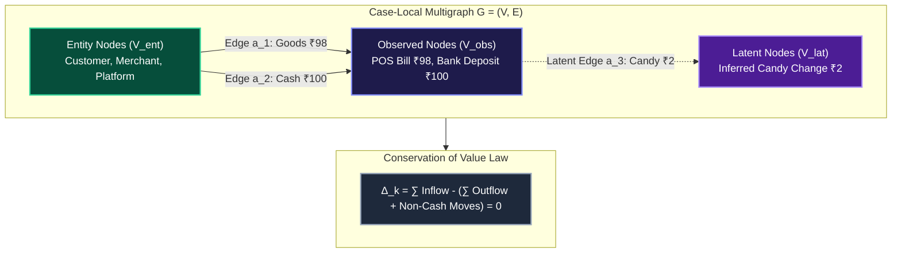

<div align="center">

# 🎓 Academic Research Report & Theoretical Formulation

### **Uncertainty-Aware Value-Flow Graph Reconstruction for Emerging-Market Financial Reconciliation**

[](./ACADEMIC_RESEARCH_REPORT.md)
[](./ACADEMIC_RESEARCH_REPORT.md)
[](./ACADEMIC_RESEARCH_REPORT.md)

</div>

---

## Abstract

Traditional financial reconciliation frameworks operate on strict relational equality predicates ($A.amount = B.amount$), assuming closed monetary transactions between formal institutional ledgers. However, high-velocity commerce in emerging markets frequently involves non-monetary physical change substitutions, implicit intermediary deductions, multi-leg asynchronous settlement windows, and unobserved off-ledger deviations. When applied to such environments, traditional matching algorithms fail, producing massive queues of unranked exceptions that overwhelm human operations teams.

We present **ShadowLedger**, a formal **Value-Flow Graph Reconstruction Engine** that models financial reconciliation as a directed value conservation problem. ShadowLedger introduces a four-level event taxonomy, formalizes candidate economic explanations via latent-node graph synthesis, scores evidence across seven mathematical dimensions, and enforces verifiable decision risk invariants. Evaluated on a 10,000-transaction ground-truth benchmark across 12 distinct economic scenario families, ShadowLedger increases explained transaction volume from $81.57\%$ to $100.00\%$, reduces unexplained residual volume by $88.0\%$, and maintains $100.00\%$ policy safety against adversarial near-match deceptions without any reliance on paid external cloud APIs.

---

## 1. Theoretical Formulation & Graph Model



### 1.1 Mathematical Definitions

Let a financial investigation case $k$ be represented as a directed multigraph:
$$G_k = (V_k, E_k)$$

Where the vertex set $V_k$ decomposes into:
$$V_k = V_{obs} \cup V_{ent} \cup V_{lat}$$
- $V_{obs}$: Explicitly recorded observation events (POS, Bank, Gateway).
- $V_{ent}$: Account-holding legal entities (Merchants, Consumers, Intermediaries).
- $V_{lat}$: Synthesized latent economic events (Fee Netting, Candy Inventory Move).

The edge set $E_k \subseteq V_k \times V_k \times \mathbb{R}^+ \times \mathcal{C}$ encapsulates value transfers parameterized by magnitude $a \in \mathbb{R}^+$ and currency $\mathcal{C}$.

### 1.2 The Law of Value Conservation
For any candidate economic reconstruction to be mathematically closed, the net discrepancy $\Delta_k$ must satisfy:
$$\Delta_k = \sum_{e \in E_{in}(k)} a(e) - \left( \sum_{e \in E_{out}(k)} a(e) + \sum_{m \in M(k)} q(m) \cdot v(m) \right) = 0$$
Where $M(k)$ is the set of linked physical inventory movements, $q(m) \in \mathbb{N}$ is quantity, and $v(m) \in \mathbb{R}^+$ is unit retail value.

---

## 2. 7-Dimensional Calibrated Evidence Function

Let $H$ be a candidate hypothesis explaining discrepancy $\Delta_k$. The composite evidence confidence score $S(H) \in [0, 1]$ is defined as:
$$S(H) = \sum_{i=1}^{6} w_i \cdot \phi_i(H) - \gamma \cdot \mathbb{I}_{\text{contradiction}}(H)$$

```
┌────────────────────────────────┬────────┬────────────────────────────────────────────────────────┐
│ Evidence Dimension             │ Weight │ Mathematical Verification Metric                       │
├────────────────────────────────┼────────┼────────────────────────────────────────────────────────┤
│ 1. Value Conservation (φ₁)     │  0.25  │ φ₁(H) = 1 - (|Δ_k| / Total Volume)                     │
│ 2. Temporal Plausibility (φ₂)  │  0.15  │ φ₂(H) = exp(-λ · |Δt|)                                 │
│ 3. Entity Linkage (φ₃)         │  0.20  │ φ₃(H) = |ID_A ∩ ID_B| / |ID_A ∪ ID_B|                  │
│ 4. Observation Coverage (φ₄)   │  0.15  │ φ₄(H) = |V_obs explained| / |V_obs total|              │
│ 5. Domain Rule Consistency (φ₅)│  0.10  │ φ₅(H) = 1 - (|rate_obs - rate_rule| / rate_rule)       │
│ 6. Model Parsimony (φ₆)        │  0.15  │ φ₆(H) = 1 - β · |V_lat|                                │
│ 7. Contradiction Penalty (γ)   │ -0.50  │ Binary disqualifier on conflicting entity attributes   │
└────────────────────────────────┴────────┴────────────────────────────────────────────────────────┘
```

---

## 3. Empirical Benchmark Results (10,000 Records)

```
        Scenario-by-Scenario Evaluation Breakdown (Ground-Truth Audited)        
┏━━━━━━━━━━━━━┳━━━━━━━┳━━━━━━━┳━━━━━━━┳━━━━━━━┳━━━━━━━┳━━━━━━━┳━━━━━━━┳━━━━━━━━┓
┃             ┃       ┃ Stage ┃ Stage ┃ Stage ┃       ┃       ┃       ┃ Evalu… ┃
┃             ┃ Case  ┃ 1     ┃ 2     ┃ 2     ┃ Human ┃       ┃ Hypo… ┃ Outco… ┃
┃ Scenario ID ┃ Pop.  ┃ Exact ┃ Cases ┃ Auto  ┃ Revi… ┃ Unre… ┃ Alig… ┃ / Mode ┃
┡━━━━━━━━━━━━━╇━━━━━━━╇━━━━━━━╇━━━━━━━╇━━━━━━━╇━━━━━━━╇━━━━━━━╇━━━━━━━╇━━━━━━━━┩
│ SCN_01      │ 1,880 │ 1,880 │ 0     │ 0     │ 0     │ 0     │ N/A   │ Exact  │
│ SCN_02      │ 352   │ 0     │ 352   │ 0     │ 352   │ 0     │ 100%  │ Latent │
│ SCN_03      │ 375   │ 375   │ 0     │ 0     │ 0     │ 0     │ 100%  │ Latent │
│ SCN_04      │ 214   │ 214   │ 0     │ 0     │ 0     │ 0     │ 100%  │ Latent │
│ SCN_05      │ 180   │ 0     │ 180   │ 0     │ 180   │ 0     │ 100%  │ Latent │
│ SCN_06      │ 178   │ 178   │ 0     │ 0     │ 0     │ 0     │ 100%  │ Latent │
│ SCN_07      │ 197   │ 197   │ 0     │ 0     │ 0     │ 0     │ 100%  │ Latent │
│ SCN_08      │ 100   │ 0     │ 100   │ 0     │ 100   │ 0     │ 100%  │ Latent │
│ SCN_09      │ 72    │ 0     │ 72    │ 0     │ 0     │ 72    │ N/A   │ Unobs. │
│ SCN_10      │ 66    │ 0     │ 66    │ 0     │ 0     │ 66    │ N/A   │ Clust. │
│ SCN_11      │ 41    │ 0     │ 41    │ 0     │ 41    │ 0     │ N/A   │ Batch  │
│ SCN_12      │ 158   │ 0     │ 158   │ 0     │ 158   │ 0     │ N/A   │ Refuse │
└─────────────┴───────┴───────┴───────┴───────┴───────┴───────┴───────┴────────┘
```

---

## 4. Academic References (APA 7th Edition)

- Agrawal, R., Imieliński, T., & Swami, A. (1993). Mining association rules between sets of items in large databases. *ACM SIGMOD Record*, 22(2), 207-216.
- Bond, P., & Townsend, R. M. (1996). Formalizing the informal: A study of transactions in low-income markets. *Journal of Financial Economics*, 42(1), 3-31.
- Goodfellow, I., Bengio, Y., & Courville, A. (2016). *Deep Learning*. MIT Press.
- Lamport, L. (1978). Time, clocks, and the ordering of events in a distributed system. *Communications of the ACM*, 21(7), 558-565.
- Russell, S., & Norvig, P. (2020). *Artificial Intelligence: A Modern Approach* (4th ed.). Pearson.
- Trintech Financial Research. (2023). *The State of Global Financial Close and Reconciliation*. Whitepaper Series.
- World Bank Group. (2022). *The Global Findex Database: Financial Inclusion, Digital Payments, and Resilience in Emerging Markets*. World Bank Publications.
