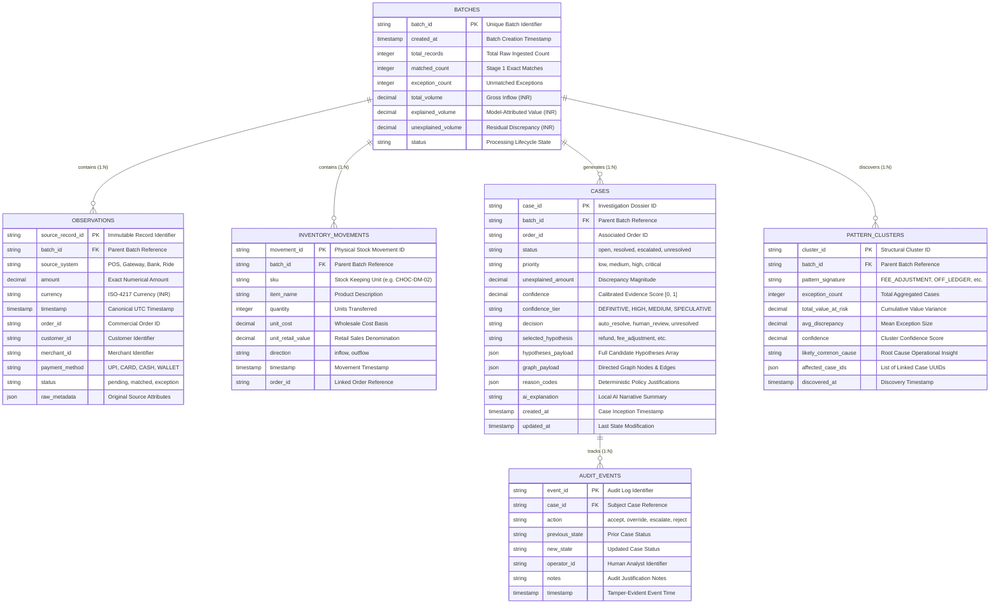
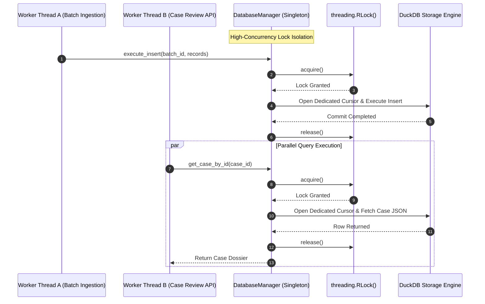

<div align="center">

# 🗄️ Database Schema & Storage Architecture

### **ShadowLedger Embedded Columnar Storage Model**

[-F59E0B?style=for-the-badge&logo=duckdb)](file:///Users/nishant/Desktop/ShadowLedger/docs/DATABASE_SCHEMA.md)
[](file:///Users/nishant/Desktop/ShadowLedger/docs/DATABASE_SCHEMA.md)
[](file:///Users/nishant/Desktop/ShadowLedger/docs/DATABASE_SCHEMA.md)

</div>

---

## 1. Entity-Relationship (ER) Diagram



---

## 2. Multi-Threaded Query Isolation & Concurrency Safety



---

## 3. Detailed Table Specifications & SQL DDLs

### 3.1 Table: `batches`
```sql
CREATE TABLE IF NOT EXISTS batches (
    batch_id VARCHAR PRIMARY KEY,
    created_at TIMESTAMP WITH TIME ZONE DEFAULT CURRENT_TIMESTAMP,
    total_records INTEGER NOT NULL,
    matched_count INTEGER NOT NULL,
    exception_count INTEGER NOT NULL,
    total_volume DECIMAL(18, 4) NOT NULL,
    explained_volume DECIMAL(18, 4) NOT NULL,
    unexplained_volume DECIMAL(18, 4) NOT NULL,
    status VARCHAR NOT NULL DEFAULT 'completed'
);
```

### 3.2 Table: `observations` (Official Ledger)
```sql
CREATE TABLE IF NOT EXISTS observations (
    source_record_id VARCHAR PRIMARY KEY,
    batch_id VARCHAR NOT NULL REFERENCES batches(batch_id),
    source_system VARCHAR NOT NULL,
    amount DECIMAL(18, 4) NOT NULL,
    currency VARCHAR(3) NOT NULL DEFAULT 'INR',
    timestamp TIMESTAMP WITH TIME ZONE NOT NULL,
    order_id VARCHAR,
    customer_id VARCHAR,
    merchant_id VARCHAR,
    payment_method VARCHAR,
    status VARCHAR NOT NULL DEFAULT 'pending',
    raw_metadata JSON
);

CREATE INDEX IF NOT EXISTS idx_obs_batch_order ON observations(batch_id, order_id);
CREATE INDEX IF NOT EXISTS idx_obs_timestamp ON observations(timestamp);
```

### 3.3 Table: `inventory_movements`
```sql
CREATE TABLE IF NOT EXISTS inventory_movements (
    movement_id VARCHAR PRIMARY KEY,
    batch_id VARCHAR NOT NULL REFERENCES batches(batch_id),
    sku VARCHAR NOT NULL,
    item_name VARCHAR NOT NULL,
    quantity INTEGER NOT NULL,
    unit_cost DECIMAL(18, 4) NOT NULL,
    unit_retail_value DECIMAL(18, 4) NOT NULL,
    direction VARCHAR NOT NULL,
    timestamp TIMESTAMP WITH TIME ZONE NOT NULL,
    order_id VARCHAR
);

CREATE INDEX IF NOT EXISTS idx_inv_order ON inventory_movements(order_id);
```

### 3.4 Table: `cases` (Investigation Dossiers)
```sql
CREATE TABLE IF NOT EXISTS cases (
    case_id VARCHAR PRIMARY KEY,
    batch_id VARCHAR NOT NULL REFERENCES batches(batch_id),
    order_id VARCHAR,
    status VARCHAR NOT NULL DEFAULT 'open',
    priority VARCHAR NOT NULL DEFAULT 'medium',
    unexplained_amount DECIMAL(18, 4) NOT NULL,
    confidence DECIMAL(5, 4) NOT NULL,
    confidence_tier VARCHAR NOT NULL,
    decision VARCHAR NOT NULL,
    selected_hypothesis VARCHAR,
    hypotheses_payload JSON,
    graph_payload JSON,
    reason_codes JSON,
    ai_explanation TEXT,
    created_at TIMESTAMP WITH TIME ZONE DEFAULT CURRENT_TIMESTAMP,
    updated_at TIMESTAMP WITH TIME ZONE DEFAULT CURRENT_TIMESTAMP
);

CREATE INDEX IF NOT EXISTS idx_cases_batch_status ON cases(batch_id, status);
CREATE INDEX IF NOT EXISTS idx_cases_priority ON cases(priority);
```

### 3.5 Table: `pattern_clusters`
```sql
CREATE TABLE IF NOT EXISTS pattern_clusters (
    cluster_id VARCHAR PRIMARY KEY,
    batch_id VARCHAR NOT NULL REFERENCES batches(batch_id),
    pattern_signature VARCHAR NOT NULL,
    exception_count INTEGER NOT NULL,
    total_value_at_risk DECIMAL(18, 4) NOT NULL,
    avg_discrepancy DECIMAL(18, 4) NOT NULL,
    confidence DECIMAL(5, 4) NOT NULL,
    likely_common_cause TEXT,
    affected_case_ids JSON,
    discovered_at TIMESTAMP WITH TIME ZONE DEFAULT CURRENT_TIMESTAMP
);

CREATE INDEX IF NOT EXISTS idx_patterns_batch ON pattern_clusters(batch_id);
```

### 3.6 Table: `audit_events`
```sql
CREATE TABLE IF NOT EXISTS audit_events (
    event_id VARCHAR PRIMARY KEY,
    case_id VARCHAR NOT NULL REFERENCES cases(case_id),
    action VARCHAR NOT NULL,
    previous_state VARCHAR,
    new_state VARCHAR NOT NULL,
    operator_id VARCHAR NOT NULL,
    notes TEXT,
    timestamp TIMESTAMP WITH TIME ZONE DEFAULT CURRENT_TIMESTAMP
);

CREATE INDEX IF NOT EXISTS idx_audit_case ON audit_events(case_id);
```
