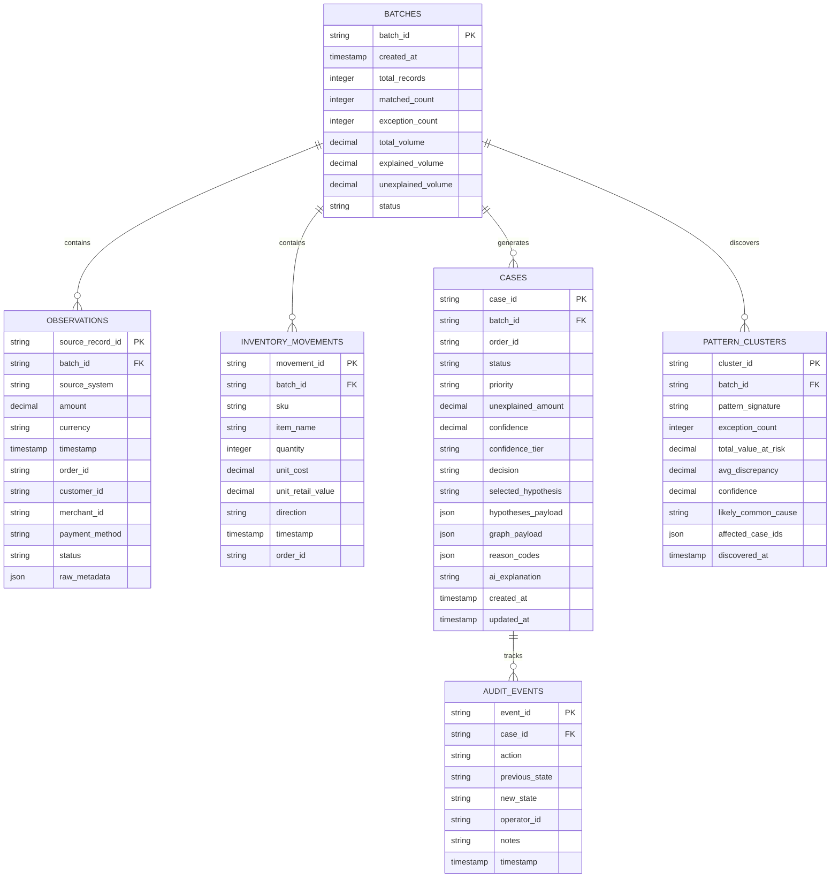

# Database Schema & Storage Architecture

**Database Engine:** Embedded DuckDB (v1.4.5)  
**Storage Paradigm:** File-Backed Columnar Engine with In-Memory Multi-Threaded Caching  
**Concurrency Model:** Reentrant Thread Lock (`threading.RLock`) with Isolated Cursor Queries  
**ACID Compliance:** Fully Atomized Transactions & Table-Level Consistency Invariants  

---

## 1. Entity-Relationship (ER) Diagram



---

## 2. Table Definitions & DDL Specifications

### 2.1 Table: `batches`
Stores batch-level metadata, processing statistics, and execution summaries.

```sql
CREATE TABLE IF NOT EXISTS batches (
    batch_id VARCHAR PRIMARY KEY,
    created_at TIMESTAMP WITH TIME ZONE DEFAULT CURRENT_TIMESTAMP,
    total_records INTEGER NOT NULL,
    matched_count INTEGER NOT NULL,
    exception_count INTEGER NOT NULL,
    total_volume DECIMAL(18, 4) NOT NULL,
    explained_volume DECIMAL(18, 4) NOT NULL,
    unexplained_volume DECIMAL(18, 4) NOT NULL,
    status VARCHAR NOT NULL DEFAULT 'completed'
);
```

---

### 2.2 Table: `observations` (Official Ledger)
Represents immutable raw transaction events ingested directly from source payment gateways, point-of-sale systems, bank statements, and mobility ride logs.

```sql
CREATE TABLE IF NOT EXISTS observations (
    source_record_id VARCHAR PRIMARY KEY,
    batch_id VARCHAR NOT NULL REFERENCES batches(batch_id),
    source_system VARCHAR NOT NULL,
    amount DECIMAL(18, 4) NOT NULL,
    currency VARCHAR(3) NOT NULL DEFAULT 'INR',
    timestamp TIMESTAMP WITH TIME ZONE NOT NULL,
    order_id VARCHAR,
    customer_id VARCHAR,
    merchant_id VARCHAR,
    payment_method VARCHAR,
    status VARCHAR NOT NULL DEFAULT 'pending',
    raw_metadata JSON
);

CREATE INDEX IF NOT EXISTS idx_obs_batch_order ON observations(batch_id, order_id);
CREATE INDEX IF NOT EXISTS idx_obs_timestamp ON observations(timestamp);
```

---

### 2.3 Table: `inventory_movements`
Captures non-monetary physical retail stock movements (e.g. Kirana chocolate change substitutions).

```sql
CREATE TABLE IF NOT EXISTS inventory_movements (
    movement_id VARCHAR PRIMARY KEY,
    batch_id VARCHAR NOT NULL REFERENCES batches(batch_id),
    sku VARCHAR NOT NULL,
    item_name VARCHAR NOT NULL,
    quantity INTEGER NOT NULL,
    unit_cost DECIMAL(18, 4) NOT NULL,
    unit_retail_value DECIMAL(18, 4) NOT NULL,
    direction VARCHAR NOT NULL,
    timestamp TIMESTAMP WITH TIME ZONE NOT NULL,
    order_id VARCHAR
);

CREATE INDEX IF NOT EXISTS idx_inv_order ON inventory_movements(order_id);
```

---

### 2.4 Table: `cases` (Investigation Workbench Dossiers)
Stores structured exception cases resulting from Stage 1 unmatched discrepancies, complete with graph topology, evaluated candidate hypotheses, and decision outcomes.

```sql
CREATE TABLE IF NOT EXISTS cases (
    case_id VARCHAR PRIMARY KEY,
    batch_id VARCHAR NOT NULL REFERENCES batches(batch_id),
    order_id VARCHAR,
    status VARCHAR NOT NULL DEFAULT 'open',
    priority VARCHAR NOT NULL DEFAULT 'medium',
    unexplained_amount DECIMAL(18, 4) NOT NULL,
    confidence DECIMAL(5, 4) NOT NULL,
    confidence_tier VARCHAR NOT NULL,
    decision VARCHAR NOT NULL,
    selected_hypothesis VARCHAR,
    hypotheses_payload JSON,
    graph_payload JSON,
    reason_codes JSON,
    ai_explanation TEXT,
    created_at TIMESTAMP WITH TIME ZONE DEFAULT CURRENT_TIMESTAMP,
    updated_at TIMESTAMP WITH TIME ZONE DEFAULT CURRENT_TIMESTAMP
);

CREATE INDEX IF NOT EXISTS idx_cases_batch_status ON cases(batch_id, status);
CREATE INDEX IF NOT EXISTS idx_cases_priority ON cases(priority);
```

---

### 2.5 Table: `pattern_clusters` (Fleet Pattern Discovery)
Stores structural anomaly patterns detected across multiple cases.

```sql
CREATE TABLE IF NOT EXISTS pattern_clusters (
    cluster_id VARCHAR PRIMARY KEY,
    batch_id VARCHAR NOT NULL REFERENCES batches(batch_id),
    pattern_signature VARCHAR NOT NULL,
    exception_count INTEGER NOT NULL,
    total_value_at_risk DECIMAL(18, 4) NOT NULL,
    avg_discrepancy DECIMAL(18, 4) NOT NULL,
    confidence DECIMAL(5, 4) NOT NULL,
    likely_common_cause TEXT,
    affected_case_ids JSON,
    discovered_at TIMESTAMP WITH TIME ZONE DEFAULT CURRENT_TIMESTAMP
);

CREATE INDEX IF NOT EXISTS idx_patterns_batch ON pattern_clusters(batch_id);
```

---

### 2.6 Table: `audit_events` (Immutable Audit Trail)
Maintains a tamper-evident log of human operator decisions, hypothesis approvals, overrides, and notes.

```sql
CREATE TABLE IF NOT EXISTS audit_events (
    event_id VARCHAR PRIMARY KEY,
    case_id VARCHAR NOT NULL REFERENCES cases(case_id),
    action VARCHAR NOT NULL,
    previous_state VARCHAR,
    new_state VARCHAR NOT NULL,
    operator_id VARCHAR NOT NULL,
    notes TEXT,
    timestamp TIMESTAMP WITH TIME ZONE DEFAULT CURRENT_TIMESTAMP
);

CREATE INDEX IF NOT EXISTS idx_audit_case ON audit_events(case_id);
```

---

## 3. Concurrency, Multi-Threading & Transaction Safety

To support high-concurrency read/write operations (e.g. concurrent batch ingestion while operators review cases in real-time), DuckDB access is encapsulated within `DatabaseManager` (`apps/api/app/persistence/database.py`):

1. **Reentrant Lock Synchronization (`threading.RLock`):** All database operations execute within synchronized blocks (`with self._lock:`), guaranteeing thread isolation across multiple async FastAPI worker threads.
2. **Dedicated Read Cursors:** Every query instantiates a dedicated local cursor (`cursor = self._conn.cursor()`) rather than reusing a shared connection handle, preventing `InvalidInputException` errors from simultaneous pending queries.
3. **Immutability of Source Facts:** Queries that generate candidate reconstructions write strictly to `cases` and `pattern_clusters`, preserving the raw integrity of `observations` at all times.
