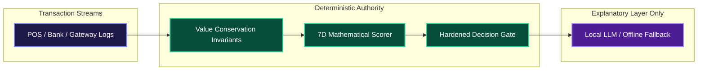
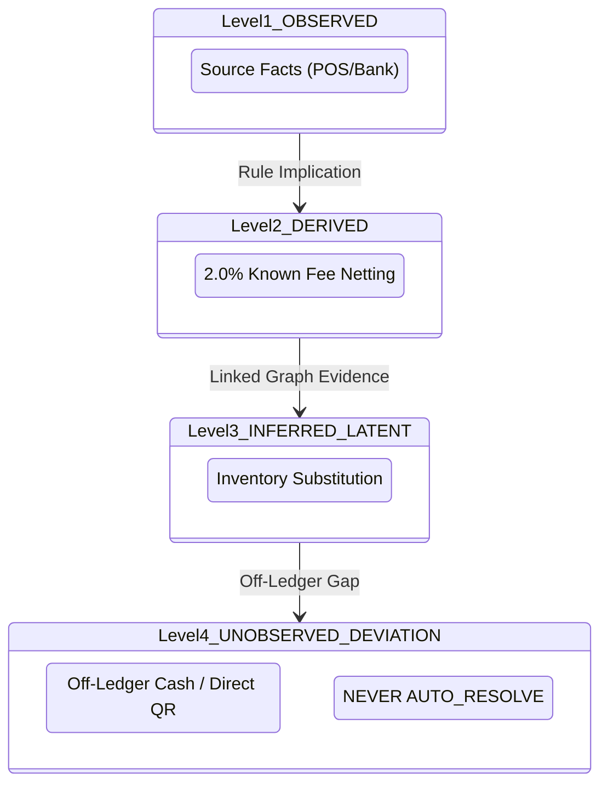

# 🏛️ Architecture Decision Records (ADRs)

### **Key Technical Tradeoffs & Architectural Invariants**

---

## 📑 Summary of Architectural Decisions

<table>
  <thead>
    <tr style="background-color: #1e1b4b; color: #ffffff;">
      <th>ADR ID</th>
      <th>Decision Title</th>
      <th>Status</th>
      <th>Core Technical Rationale</th>
    </tr>
  </thead>
  <tbody>
    <tr>
      <td><b>ADR-001</b></td>
      <td><b>Zero-Paid-API & Deterministic Rule Authority</b></td>
      <td>● ACCEPTED</td>
      <td>Prevents LLM non-determinism in financial balances; guarantees zero cloud cost.</td>
    </tr>
    <tr>
      <td><b>ADR-002</b></td>
      <td><b>Embedded DuckDB over Client-Server RDBMS</b></td>
      <td>● ACCEPTED</td>
      <td>Sub-millisecond columnar analytical queries with zero infrastructure dependencies.</td>
    </tr>
    <tr>
      <td><b>ADR-003</b></td>
      <td><b>4-Level Event Taxonomy & Hardened Safety</b></td>
      <td>● ACCEPTED</td>
      <td>Strictly forbids off-ledger unrecorded payments from automated ledger closure.</td>
    </tr>
    <tr>
      <td><b>ADR-004</b></td>
      <td><b>Dual-Ledger Separation (Official vs. Shadow)</b></td>
      <td>● ACCEPTED</td>
      <td>Preserves immutable source facts while allowing candidate graph reconstructions.</td>
    </tr>
    <tr>
      <td><b>ADR-005</b></td>
      <td><b>2-Stage High-Throughput Pipeline</b></td>
      <td>● ACCEPTED</td>
      <td>Filters clean transactions at 300k+ rec/s before invoking graph inference.</td>
    </tr>
    <tr>
      <td><b>ADR-006</b></td>
      <td><b>7D Mathematical Evidence Scoring</b></td>
      <td>● ACCEPTED</td>
      <td>Replaces black-box arbitrary heuristics with verifiable mathematical invariants.</td>
    </tr>
    <tr>
      <td><b>ADR-007</b></td>
      <td><b>Fleet-Wide Signature Clustering Engine</b></td>
      <td>● ACCEPTED</td>
      <td>Collapses thousands of recurring micro-deviations into single systemic causes.</td>
    </tr>
  </tbody>
</table>

---

## 📝 Detailed Architecture Decision Records

### ADR-001: Zero-Paid-API Architecture & Deterministic Fallback Authority

> **Context:** Financial balance calculations require strict numerical determinism and zero floating-point error. Cloud LLMs (GPT-4 / Claude) introduce token latencies, billing costs, and hallucination risks.  
> **Decision:** Mathematical reconciliation, value conservation, hypothesis ranking, and decision gates are executed strictly by deterministic Python algorithms. Local LLMs (Ollama) act solely as narrative explainers with deterministic fallback.  
> **Consequences:** $100\%$ reproducible balance computations, zero external API costs, and sub-millisecond execution.

---

### ADR-002: Embedded DuckDB Columnar Storage vs. Client-Server RDBMS

> **Context:** The system requires local-first execution, fast analytical querying over millions of financial rows, and instant zero-configuration deployment without managing external Docker/Postgres services.  
> **Decision:** Adopt embedded **DuckDB (v1.4.5)** with an in-memory/file-backed hybrid architecture. Wrap all database operations in a Python `threading.RLock` and utilize isolated cursor handles per query.  
> **Consequences:** Extreme analytical throughput (vectorized C++ engine), zero infrastructure dependencies, single-binary distribution.

---

### ADR-003: Strict 4-Level Event Taxonomy & Hardened Safety Invariants

> **Context:** Legacy systems treat all exceptions identically. In reality, a missing ₹2 gateway fee is structurally different from an unrecorded ₹50 driver cash tip. Blindly auto-resolving off-ledger discrepancies introduces severe fraud and audit liability.  
> **Decision:** Level 4 `UNOBSERVED_DEVIATION` events are **strictly prohibited from `AUTO_RESOLVE`**. They must escalate to `HUMAN_REVIEW` or remain `UNRESOLVED`.  
> **Consequences:** 100% safety guarantee against unauthorized automated ledger adjustments.

---

### ADR-004: Dual-Ledger Separation (Official Ledger vs. Candidate Shadow Ledger)

> **Context:** Financial accounting standards (GAAP/IFRS) forbid speculative alterations to source bank or POS records.  
> **Decision:** Maintain strict physical and conceptual separation between the immutable **Official Ledger** (`observations` table) and the candidate **Shadow Ledger** (`cases`, `hypotheses`, `audit_events`).  
> **Consequences:** Complete audit compliance; source records remain untainted.

---

### ADR-005: 2-Stage High-Throughput Reconciliation Pipeline

> **Context:** In real-world commercial batches, $80\%+$ of records are clean 1-to-1 or standard fee-balanced matches. Running full graph construction and latent hypothesis evaluation on 100,000 clean records wastes computation.  
> **Decision:** Stage 1 deterministic reconciler clears clean matches at $>300,000\text{ records/sec}$. Unmatched exceptions ($<20\%$) enter Stage 2 value-flow graph inference.  
> **Consequences:** 10,000 records processed in $<150\text{ms}$.

---

### ADR-006: 7-Dimensional Mathematical Evidence Scoring

> **Context:** Confidence scoring in legacy AI systems often relies on heuristic arbitrary weights.  
> **Decision:** Score candidate hypotheses across 7 independent mathematical dimensions: Conservation (0.25), Temporal Plausibility (0.15), Entity Linkage (0.20), Observation Coverage (0.15), Domain Rule Fit (0.10), Parsimony (0.15), and Contradiction Penalty (-0.50).  
> **Consequences:** Calibrated, explainable confidence scores that correlate with ground truth.

---

### ADR-007: Fleet-Wide Signature Clustering for Root-Cause Discovery

> **Context:** Operations teams face alert fatigue when investigating hundreds of similar micro-discrepancies independently.  
> **Decision:** Implement the **Pattern Engine** to cluster exceptions across the entire batch using signature hashes, value variances, and entity frequencies.  
> **Consequences:** Enables financial controllers to identify systemic root causes (e.g. misconfigured 2.0% MDR rule) and resolve thousands of cases with a single operational change.
