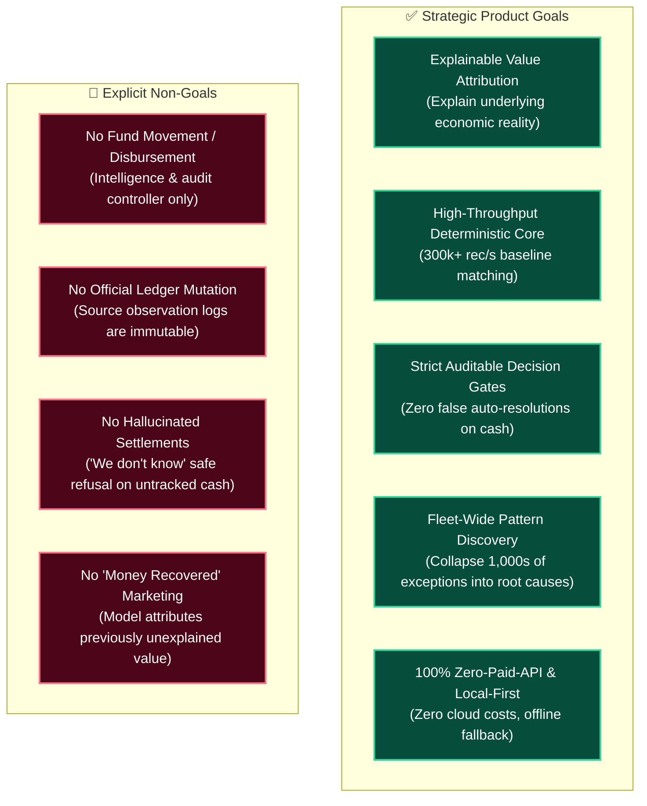
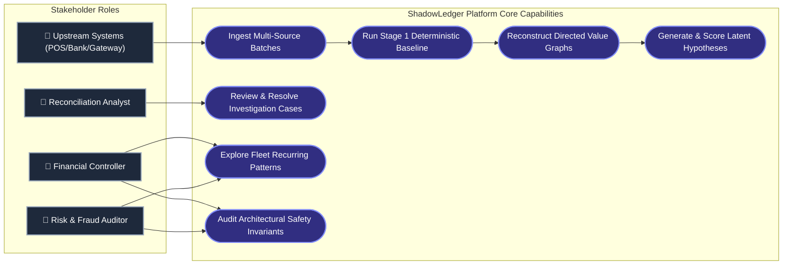

<div align="center">

# 📋 Product Requirements Document (PRD)

### **ShadowLedger: Uncertainty-Aware Value-Flow Reconstruction Engine**

[-10B981?style=for-the-badge&logo=semver&logoColor=white)](file:///Users/nishant/Desktop/ShadowLedger/docs/PRD.md)
[](file:///Users/nishant/Desktop/ShadowLedger/docs/PRD.md)
[](file:///Users/nishant/Desktop/ShadowLedger/docs/PRD.md)

</div>

---

## 1. Executive Summary & Market Context

Modern commerce in emerging markets (particularly India) is characterized by multi-party, asynchronous, and non-monetary transaction flows:
- **Kirana retail** substitutes physical chocolate candy or matchboxes for small change ($₹1$–$₹5$).
- **Mobility and ride-hailing** encounter off-ledger driver cash or direct UPI QR deviations ($₹20$–$₹100$).
- **E-commerce gateways** deduct dynamic merchant discount rate (MDR) fees ($1.5\%$–$2.5\%$) prior to net bank settlement.
- **Batches split** across T+1/T+2 settlement cutoffs and bank holidays.

Traditional 2-way and 3-way reconciliation software matches records strictly on equality (`POS.amount == Bank.amount`). When records diverge by even $₹2$, legacy systems flag an unranked exception and dump it into a massive human backlog.

**ShadowLedger** is an uncertainty-aware **Value-Flow Reconstruction Engine**. It reconstructs the underlying economic reality behind discrepancies, represents them as directed value-flow graphs, generates candidate economic hypotheses, calibrates evidence confidence across 7 mathematical dimensions, and enforces strict, auditable decision risk gates.

---

## 2. Product Goals & Non-Goals



---

## 3. User Personas & Pain Points

<table>
  <thead>
    <tr style="background-color: #1e1b4b; color: #ffffff;">
      <th>Persona</th>
      <th>Role & Responsibility</th>
      <th>Key Pain Points</th>
      <th>ShadowLedger Value Proposition</th>
    </tr>
  </thead>
  <tbody>
    <tr>
      <td><b>Priya Sharma</b><br><span style="color:#818cf8">Financial Controller</span></td>
      <td>Month-end financial close, balance sheet reconciliation, regulatory compliance.</td>
      <td>Unexplained residual balances at month-end; risk of unauthorized write-offs; audit vulnerability.</td>
      <td>Complete visibility into model-attributed value, 7D evidence calibration, and tamper-evident audit logs.</td>
    </tr>
    <tr>
      <td><b>Arjun Mehta</b><br><span style="color:#34d399">Reconciliation Ops Lead</span></td>
      <td>Daily queue management, exception clearance, ticket routing.</td>
      <td>Daily flood of 5,000+ unranked exception rows; manual repetitive lookups for known MDR deductions.</td>
      <td>Automated high-confidence resolutions, ranked human-review queues with pre-built value-flow graphs.</td>
    </tr>
    <tr>
      <td><b>Rohan Das</b><br><span style="color:#f59e0b">Fraud & Risk Auditor</span></td>
      <td>Fleet anomaly detection, fraud mitigation, merchant policy compliance.</td>
      <td>Undetected systemic micro-leakages across merchant fleets; alert fatigue from disconnected single rows.</td>
      <td>Pattern Discovery Engine collapses micro-anomalies into systemic operational clusters.</td>
    </tr>
  </tbody>
</table>

---

## 4. Complete Use Case Diagram



---

## 5. Hero Scenarios & Demonstration Contracts

### 🍭 Hero A: Kirana Non-Monetary Settlement (`hero_a_kirana`)
- **Real-World Context:** A customer purchases $₹98$ worth of groceries at a Kirana store, pays $₹100$ cash/UPI, and receives a $₹2$ Dairy Milk chocolate candy as physical change.
- **Input Records:** POS Bill ($₹98$), Bank Deposit ($₹100$), Inventory Move (1x Dairy Milk, retail value $₹2$).
- **Expected Outcome:** Reconciles deterministically via conservation of value: $₹98 \text{ (Goods)} + ₹2 \text{ (Candy)} = ₹100 \text{ (Tendered)}$. Confidence: $0.95$ (`DEFINITIVE`), Decision: **`AUTO_RESOLVE`**.

### 🚗 Hero B: Mobility Fare Deviation & Safety Refusal (`hero_b_mobility`)
- **Real-World Context:** Two ride-hailing trips are booked at $₹150$ official platform fare. Both drivers demand $₹200$.
  - **Trip 1 (Digital Trace):** Passenger transfers $₹50$ extra via direct driver UPI QR.
  - **Trip 2 (Cash Only):** Passenger hands $₹50$ physical cash; zero digital trace exists.
- **Expected Outcome:**
  - Trip 1: Reconstructs off-ledger deviation using UPI trace graph $\rightarrow$ Confidence: $0.85$ (`HIGH`), Decision: **`HUMAN_REVIEW`** (Enforces safety invariant: Off-ledger events *never* auto-resolve).
  - Trip 2: No digital footprint $\rightarrow$ Confidence: $0.00$, Decision: **`UNRESOLVED`** (Strict safety refusal: Zero hallucination).

### 🔍 Hero C: Fleet Cross-Case Pattern Discovery (`hero_c_patterns`)
- **Real-World Context:** 30 multi-party discrepancy cases across 60 raw logs.
- **Expected Outcome:** Pattern Discovery Engine collapses 30 individual cases into **3 distinct structural clusters**:
  1. *FEE_ADJUSTMENT* (13 cases, $₹55,360$ at risk) $\rightarrow$ Systematic 2.0% gateway MDR deduction.
  2. *OFF_LEDGER_DEVIATION* (10 cases, $₹2,000$ at risk) $\rightarrow$ Recurring mobility fare deviation pattern.
  3. *INVENTORY_SETTLEMENT* (7 cases, $₹1,190$ at risk) $\rightarrow$ Recurring non-cash inventory settlement pattern.

---

## 6. Functional & Non-Functional Requirements

### 6.1 Functional Requirements Matrix

| Req ID | Module | Requirement Description | Priority | Verification Method |
| :--- | :--- | :--- | :--- | :--- |
| **FR-01** | Ingestion | Ingest JSON, CSV, and programmatic batches with canonical UTC and Decimal precision | P0 | Unit Tests (`test_ingest.py`) |
| **FR-02** | Reconciler | Baseline deterministic matching of 1-to-1, standard MDR fee, and candy change pairs | P0 | Unit Tests (`test_reconciler.py`) |
| **FR-03** | Graph Engine | Construct case-local NetworkX directed multigraphs with node provenance labels | P0 | Unit Tests (`test_graph_builder.py`) |
| **FR-04** | Hypotheses | Generate candidate latent hypotheses across 6 economic families | P0 | Unit Tests (`test_hypothesis_engine.py`) |
| **FR-05** | Evidence Scorer | Compute 7-dimension calibrated confidence score in range $[0.00, 1.00]$ | P0 | Unit Tests (`test_evidence_scorer.py`) |
| **FR-06** | Decision Gate | Enforce strict decision gates (`AUTO_RESOLVE`, `HUMAN_REVIEW`, `UNRESOLVED`) | P0 | Adversarial Tests (`test_adversarial.py`) |
| **FR-07** | Pattern Engine | Aggregate batch exceptions into signature clusters with value at risk | P0 | Unit Tests (`test_pattern_engine.py`) |
| **FR-08** | Local AI | Offline narrative explanation generation with deterministic template fallback | P1 | AI Tests (`test_local_ai.py`) |

### 6.2 Non-Functional Requirements (NFR)

```
┌───────────────────────────────────┬──────────────────────────────────────────────────────────┐
│ Performance Metric                │ SLA / Invariant Bound                                    │
├───────────────────────────────────┼──────────────────────────────────────────────────────────┤
│ Stage 1 Baseline Throughput       │ ≥ 300,000 records / second                               │
│ Stage 2 Value-Flow Throughput     │ ≥ 50,000 records / second                                │
│ 10,000-Record Total Execution     │ < 200 ms total processing time                           │
│ Unsafe False Auto-Resolutions     │ EXACTLY 0 (100% Policy Safe)                             │
│ Cloud Infrastructure Cost         │ $0.00 (Zero paid APIs, 100% offline local-first)         │
│ Concurrency Thread Safety         │ Multi-threaded isolated DuckDB queries with RLock        │
└───────────────────────────────────┴──────────────────────────────────────────────────────────┘
```
