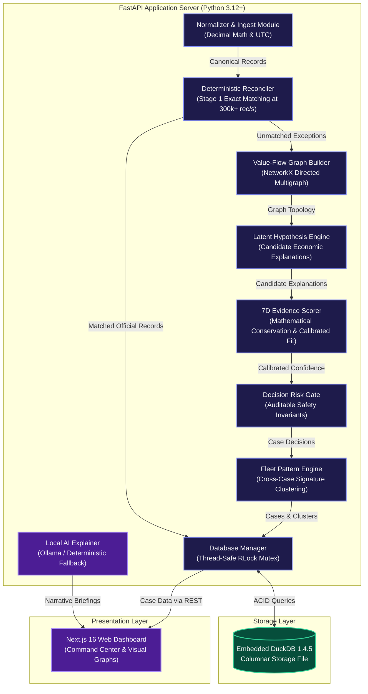
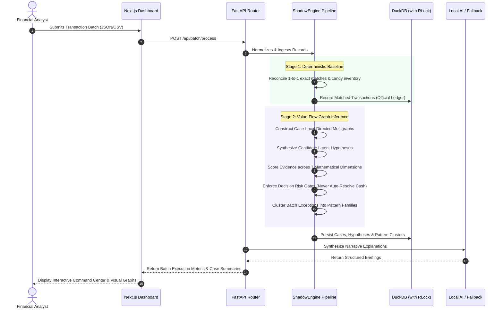

<div align="center">

# 🏗️ System Architecture & REST API Specification

### **ShadowLedger: Uncertainty-Aware Value-Flow Reconstruction Engine**

[](file:///Users/nishant/Desktop/ShadowLedger/docs/SYSTEM_ARCHITECTURE.md)
[](file:///Users/nishant/Desktop/ShadowLedger/docs/SYSTEM_ARCHITECTURE.md)
[](file:///Users/nishant/Desktop/ShadowLedger/docs/SYSTEM_ARCHITECTURE.md)

</div>

---

## 1. High-Level C4 Component Diagram



---

## 2. End-to-End Batch Processing Sequence



---

## 3. Comprehensive REST API Specification

Base URL: `http://localhost:8000`

### 3.1 System Health
```http
GET /health
```
- **Description:** Verifies server availability, database connectivity, and engine version.
- **Response `200 OK`:**
```json
{
  "status": "healthy",
  "version": "1.0.0",
  "database": "connected",
  "timestamp": "2026-09-02T03:00:00Z"
}
```

---

### 3.2 Batch Ingestion & Processing
```http
POST /api/batch/process
```
- **Description:** Ingests and processes a multi-source transaction batch through the 7-stage reconstruction pipeline.
- **Request Body:**
```json
{
  "batch_id": "batch_retail_001",
  "records": [
    {
      "source_record_id": "pos_101",
      "source_system": "pos",
      "amount": 98.00,
      "currency": "INR",
      "timestamp": "2026-09-01T10:00:00Z",
      "order_id": "ORD-101",
      "customer_id": "CUST-01",
      "merchant_id": "MKT-01"
    },
    {
      "source_record_id": "bank_101",
      "source_system": "bank_feed",
      "amount": 100.00,
      "currency": "INR",
      "timestamp": "2026-09-01T10:00:05Z",
      "order_id": "ORD-101",
      "customer_id": "CUST-01",
      "merchant_id": "MKT-01"
    }
  ],
  "inventory_movements": [
    {
      "movement_id": "inv_101",
      "sku": "CHOC-DM-02",
      "quantity": 1,
      "unit_retail_value": 2.00,
      "direction": "outflow",
      "timestamp": "2026-09-01T10:00:00Z",
      "order_id": "ORD-101"
    }
  ]
}
```
- **Response `200 OK`:**
```json
{
  "batch_id": "batch_retail_001",
  "total_records": 2,
  "matched_count": 2,
  "exception_count": 0,
  "case_count": 0,
  "total_volume": 100.00,
  "explained_volume": 100.00,
  "unexplained_volume": 0.00,
  "processing_time_ms": 4.12
}
```

---

### 3.3 Investigation Cases & Actions
```http
GET /api/cases
```
- **Query Parameters:** `status` (open/resolved/escalated/unresolved), `priority` (low/medium/high/critical), `batch_id`, `limit`.
- **Response `200 OK`:**
```json
{
  "total_cases": 1,
  "cases": [
    {
      "case_id": "case_507805805fff",
      "batch_id": "hero_kirana_demo",
      "order_id": "ORD-KIRANA-001",
      "status": "resolved",
      "priority": "low",
      "unexplained_amount": 2.00,
      "confidence": 0.95,
      "decision": "auto_resolve",
      "selected_hypothesis": "inventory_settlement"
    }
  ]
}
```

```http
GET /api/cases/{case_id}
```
- **Description:** Returns full investigation dossier with graph nodes/edges, 7D evidence scores, and local AI explanation.
- **Response `200 OK`:**
```json
{
  "case_id": "case_507805805fff",
  "batch_id": "hero_kirana_demo",
  "order_id": "ORD-KIRANA-001",
  "graph": {
    "nodes": [
      {"id": "entity:CUST-01", "type": "customer", "label": "Customer 01"},
      {"id": "entity:MKT-01", "type": "merchant", "label": "Kirana Store"},
      {"id": "event:pos_101", "type": "observation", "label": "POS Bill ₹98"}
    ],
    "edges": [
      {"source": "entity:CUST-01", "target": "entity:MKT-01", "amount": 100.00, "label": "Cash Tendered"}
    ]
  },
  "hypotheses": [
    {
      "hypothesis_id": "hyp_01",
      "hypothesis_type": "inventory_settlement",
      "confidence_score": 0.95,
      "confidence_tier": "DEFINITIVE",
      "dimension_scores": {
        "mathematical_conservation": 1.0,
        "temporal_plausibility": 1.0,
        "entity_linkage": 1.0,
        "observation_coverage": 1.0,
        "domain_rule_fit": 1.0,
        "parsimony": 0.95,
        "contradiction_penalty": 0.0
      }
    }
  ],
  "decision": {
    "decision": "auto_resolve",
    "reason_codes": ["AUTO_RESOLVED_INVENTORY_SETTLEMENT_HIGH_CONFIDENCE"]
  },
  "ai_explanation": "Reconciled ₹2 discrepancy via 1x Dairy Milk chocolate candy non-monetary physical change substitution."
}
```

```http
POST /api/cases/{case_id}/action
```
- **Description:** Human operator action (Accept Hypothesis, Override Decision, Escalate).
- **Request Body:**
```json
{
  "action": "accept",
  "hypothesis_id": "hyp_01",
  "operator_id": "analyst_arjun",
  "notes": "Verified chocolate inventory movement against Kirana register."
}
```
- **Response `200 OK`:**
```json
{
  "case_id": "case_507805805fff",
  "new_status": "resolved",
  "audit_event_id": "aud_984128",
  "updated_at": "2026-09-02T03:15:00Z"
}
```

---

### 3.4 Fleet Pattern Discovery
```http
GET /api/patterns
```
- **Description:** Returns structural pattern clusters across cases.
- **Response `200 OK`:**
```json
{
  "total_clusters": 3,
  "clusters": [
    {
      "cluster_id": "pat_01",
      "pattern_signature": "FEE_ADJUSTMENT",
      "exception_count": 13,
      "total_value_at_risk": 55360.00,
      "likely_common_cause": "Systematic payment gateway MDR fee deduction across 13 settlements. Matches ~2.0% standard merchant discount rate."
    },
    {
      "cluster_id": "pat_02",
      "pattern_signature": "OFF_LEDGER_DEVIATION",
      "exception_count": 10,
      "total_value_at_risk": 2000.00,
      "likely_common_cause": "Recurring mobility fare deviation pattern across 10 trips. Possible off-ledger fare discrepancy."
    },
    {
      "cluster_id": "pat_03",
      "pattern_signature": "INVENTORY_SETTLEMENT",
      "exception_count": 7,
      "total_value_at_risk": 1190.00,
      "likely_common_cause": "Recurring non-cash inventory settlement pattern across 7 transactions. Possible physical change substitution pattern."
    }
  ]
}
```

---

### 3.5 Dynamic Benchmark Endpoint
```http
GET /api/metrics/benchmark
```
- **Description:** Returns ground-truth evaluated benchmark performance comparing Stage 1 baseline against the full ShadowLedger engine across all 12 economic scenario families.
- **Response `200 OK`:** Returns structured comparison metrics and per-scenario breakdowns.
