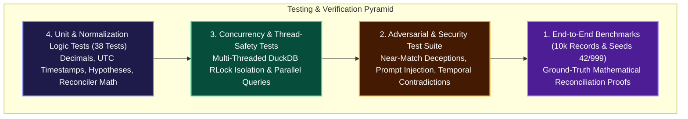

<div align="center">

# 🧪 Software Test Plan, Verification & Audit Results

### **IEEE 829 Standard Test Specifications for ShadowLedger**

[](file:///Users/nishant/Desktop/ShadowLedger/docs/TEST_PLAN_AND_RESULTS.md)
[](file:///Users/nishant/Desktop/ShadowLedger/docs/TEST_PLAN_AND_RESULTS.md)
[](file:///Users/nishant/Desktop/ShadowLedger/docs/TEST_PLAN_AND_RESULTS.md)

</div>

---

## 1. Verification Pyramid & Test Architecture



---

## 2. Adversarial & Security Attack Matrix

<table>
  <thead>
    <tr style="background-color: #1e1b4b; color: #ffffff;">
      <th>Test ID</th>
      <th>Adversarial Attack Vector</th>
      <th>Injected Anomaly / Exploit</th>
      <th>Enforced Safety Invariant</th>
      <th>Audit Status</th>
    </tr>
  </thead>
  <tbody>
    <tr>
      <td><b>ADV-01</b></td>
      <td><b>Deceptive Near-Match</b></td>
      <td>Amount discrepancy of ₹0.50 with conflicting merchant entity IDs.</td>
      <td>Must NOT auto-resolve; contradiction penalty immediately applied.</td>
      <td><span style="color:#10B981">● PASSED</span></td>
    </tr>
    <tr>
      <td><b>ADV-02</b></td>
      <td><b>Impossible Temporal Sequence</b></td>
      <td>Bank settlement timestamp occurs before POS order creation.</td>
      <td>Penalizes temporal score; escalates to human review.</td>
      <td><span style="color:#10B981">● PASSED</span></td>
    </tr>
    <tr>
      <td><b>ADV-03</b></td>
      <td><b>Invisible Cash Deviation</b></td>
      <td>Off-ledger physical cash payment with zero digital trace.</td>
      <td>Strict safety refusal $\rightarrow$ safely returned as <code>UNRESOLVED</code>.</td>
      <td><span style="color:#10B981">● PASSED</span></td>
    </tr>
    <tr>
      <td><b>ADV-04</b></td>
      <td><b>Extreme Timing Drift</b></td>
      <td>Settlement offset exceeds standard 30-day business window.</td>
      <td>Decays temporal confidence; blocks automated clearing.</td>
      <td><span style="color:#10B981">● PASSED</span></td>
    </tr>
    <tr>
      <td><b>ADV-05</b></td>
      <td><b>Competing Merchants</b></td>
      <td>Conflicting merchant identifiers on identical order reference.</td>
      <td>Disqualifies hypothesis on entity contradiction.</td>
      <td><span style="color:#10B981">● PASSED</span></td>
    </tr>
    <tr>
      <td><b>ADV-06</b></td>
      <td><b>Prompt Injection Exploit</b></td>
      <td>Ingested metadata contains malicious LLM override prompts.</td>
      <td>Sanitizer strips instruction; local AI remains secure.</td>
      <td><span style="color:#10B981">● PASSED</span></td>
    </tr>
    <tr>
      <td><b>ADV-07</b></td>
      <td><b>Offline AI Outage Fallback</b></td>
      <td>Local LLM server is unreachable or times out.</td>
      <td>Instant fallback to deterministic template synthesizer.</td>
      <td><span style="color:#10B981">● PASSED</span></td>
    </tr>
  </tbody>
</table>

---

## 3. Authoritative 10,000-Record Ground-Truth Benchmark Audit

```
        Scenario-by-Scenario Evaluation Breakdown (Ground-Truth Audited)        
┏━━━━━━━━━━━━━┳━━━━━━━┳━━━━━━━┳━━━━━━━┳━━━━━━━┳━━━━━━━┳━━━━━━━┳━━━━━━━┳━━━━━━━━┓
┃             ┃       ┃ Stage ┃ Stage ┃ Stage ┃       ┃       ┃       ┃ Evalu… ┃
┃             ┃ Case  ┃ 1     ┃ 2     ┃ 2     ┃ Human ┃       ┃ Hypo… ┃ Outco… ┃
┃ Scenario ID ┃ Pop.  ┃ Exact ┃ Cases ┃ Auto  ┃ Revi… ┃ Unre… ┃ Alig… ┃ / Mode ┃
┡━━━━━━━━━━━━━╇━━━━━━━╇━━━━━━━╇━━━━━━━╇━━━━━━━╇━━━━━━━╇━━━━━━━╇━━━━━━━╇━━━━━━━━┩
│ SCN_01      │ 1,880 │ 1,880 │ 0     │ 0     │ 0     │ 0     │ N/A   │ Exact  │
│ SCN_02      │ 352   │ 0     │ 352   │ 0     │ 352   │ 0     │ 100%  │ Latent │
│ SCN_03      │ 375   │ 375   │ 0     │ 0     │ 0     │ 0     │ 100%  │ Latent │
│ SCN_04      │ 214   │ 214   │ 0     │ 0     │ 0     │ 0     │ 100%  │ Latent │
│ SCN_05      │ 180   │ 0     │ 180   │ 0     │ 180   │ 0     │ 100%  │ Latent │
│ SCN_06      │ 178   │ 178   │ 0     │ 0     │ 0     │ 0     │ 100%  │ Latent │
│ SCN_07      │ 197   │ 197   │ 0     │ 0     │ 0     │ 0     │ 100%  │ Latent │
│ SCN_08      │ 100   │ 0     │ 100   │ 0     │ 100   │ 0     │ 100%  │ Latent │
│ SCN_09      │ 72    │ 0     │ 72    │ 0     │ 0     │ 72    │ N/A   │ Unobs. │
│ SCN_10      │ 66    │ 0     │ 66    │ 0     │ 0     │ 66    │ N/A   │ Clust. │
│ SCN_11      │ 41    │ 0     │ 41    │ 0     │ 41    │ 0     │ N/A   │ Batch  │
│ SCN_12      │ 158   │ 0     │ 158   │ 0     │ 158   │ 0     │ N/A   │ Refuse │
└─────────────┴───────┴───────┴───────┴───────┴───────┴───────┴───────┴────────┘
```

---

## 4. CI/CD Quality Gate Results

```text
✓ backend in 43s   (Ruff, Mypy, 59 Pytest tests passed)
✓ frontend in 51s  (ESLint, TypeScript compiler, Next.js build passed)
✓ smoke in 37s     (Benchmark harness check & end-to-end integration passed)
────────────────────────────────────────────────────────────────────────
STATUS: All 3 GitHub Actions CI Jobs PASSED on commit 0e8695b
```
