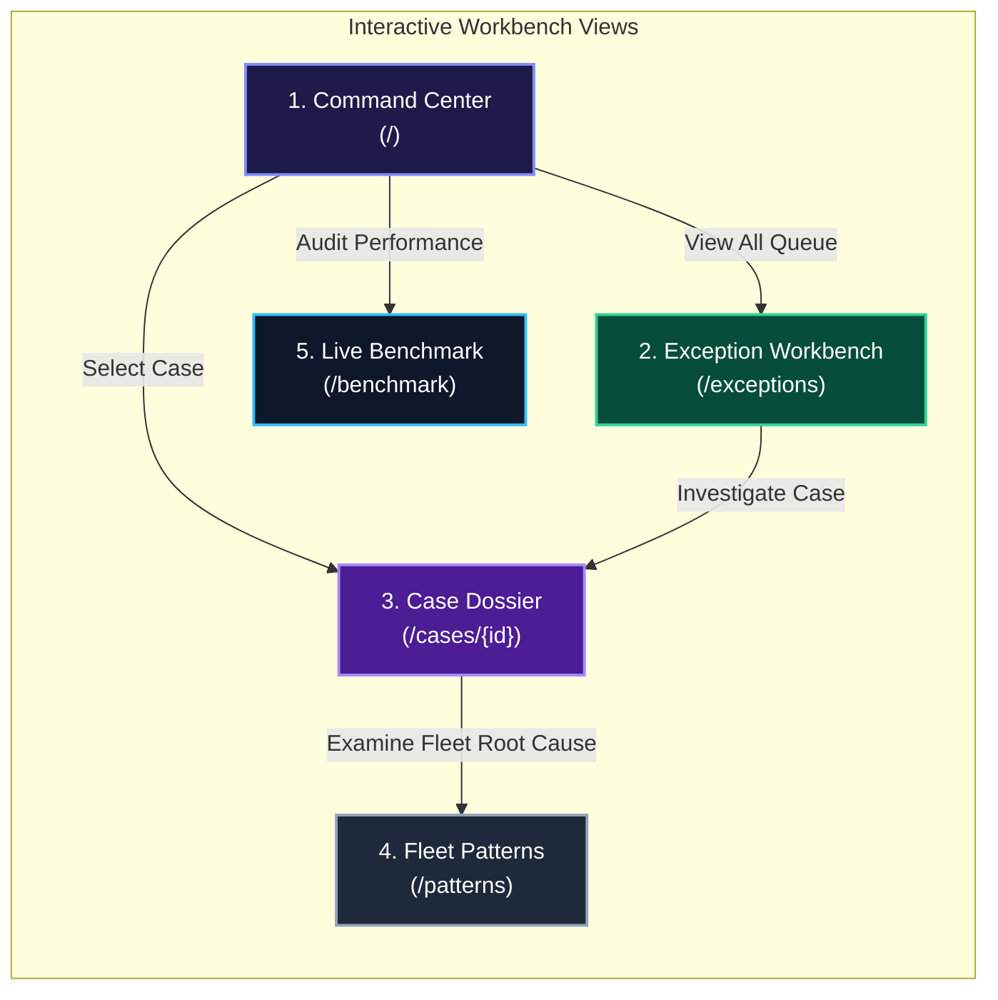

<div align="center">

# 📖 Financial Controller & Operator User Manual

### **Step-by-Step Investigation & Playbook Guide for ShadowLedger**

[](file:///Users/nishant/Desktop/ShadowLedger/docs/USER_MANUAL.md)
[](file:///Users/nishant/Desktop/ShadowLedger/docs/USER_MANUAL.md)
[](file:///Users/nishant/Desktop/ShadowLedger/docs/USER_MANUAL.md)

</div>

---

## 1. Workbench Navigation Map



---

## 2. Step-by-Step Operator Playbook

```mermaid
flowchart TD
    START([1. Anomaly Flagged in Exceptions Queue]) --> INSPECT[2. Open Case Dossier]
    INSPECT --> GRAPH[3. Inspect Directed Value-Flow Graph]
    GRAPH --> HYPO[4. Evaluate Ranked Candidate Hypotheses]
    HYPO --> SCORE[5. Review 7D Evidence Breakdown]
    
    SCORE --> DECISION{6. Operator Decision}
    
    DECISION -->|Confidence ≥ 0.85 & Validated| ACCEPT[✅ Accept Hypothesis<br/>Records to Audit Trail]
    DECISION -->|Materiality High / Policy Ambiguous| ESCALATE[⚠️ Escalate to Supervisor<br/>Routes to Senior Controller]
    DECISION -->|Missing Digital Trace (Cash)| UNRES[🛑 Confirm Unresolved<br/>Refuses False Guess]

    classDef procStyle fill:#1e293b,stroke:#818cf8,stroke-width:2px,color:#fff;
    classDef accStyle fill:#064e3b,stroke:#34d399,stroke-width:2px,color:#fff;
    classDef escStyle fill:#451a03,stroke:#f59e0b,stroke-width:2px,color:#fff;
    classDef unresStyle fill:#4c0519,stroke:#fb7185,stroke-width:2px,color:#fff;

    class START,INSPECT,GRAPH,HYPO,SCORE procStyle;
    class ACCEPT accStyle;
    class ESCALATE escStyle;
    class UNRES unresStyle;
```

---

## 3. Decision Gate Reference & Action Rules

<table>
  <thead>
    <tr style="background-color: #1e1b4b; color: #ffffff;">
      <th>Decision Badge</th>
      <th>Trigger Condition</th>
      <th>System Behavior</th>
      <th>Required Operator Action</th>
    </tr>
  </thead>
  <tbody>
    <tr>
      <td><span style="background-color:#064e3b; color:#34d399; padding:4px 8px; border-radius:4px; font-weight:bold;">AUTO_RESOLVE</span></td>
      <td>Level 1/2/3 events with Confidence $\ge 0.85$ and Materiality $< ₹5,000$.</td>
      <td>Closed deterministically via conservation of value.</td>
      <td>No action required. Automatically recorded to candidate shadow ledger.</td>
    </tr>
    <tr>
      <td><span style="background-color:#451a03; color:#f59e0b; padding:4px 8px; border-radius:4px; font-weight:bold;">HUMAN_REVIEW</span></td>
      <td>Level 4 `OFF_LEDGER_DEVIATION`, Moderate Confidence ($0.60 \le S < 0.85$), or Materiality $\ge ₹5,000$.</td>
      <td>Pre-builds value-flow graph, ranks hypotheses, and escalates to queue.</td>
      <td>Inspect graph nodes, verify external counterparty logs, and click <b>Accept</b> or <b>Override</b>.</td>
    </tr>
    <tr>
      <td><span style="background-color:#4c0519; color:#fb7185; padding:4px 8px; border-radius:4px; font-weight:bold;">UNRESOLVED</span></td>
      <td>Confidence $< 0.60$ or unobserved physical cash without corroborating trace.</td>
      <td>Refuses to guess or hallucinate ungrounded latent events.</td>
      <td>Confirm as unresolvable pending additional external evidence.</td>
    </tr>
  </tbody>
</table>

---

## 4. Frequently Asked Questions (FAQ)

### Q1: Why did an off-ledger cash fare discrepancy not auto-resolve?
> **Answer:** ShadowLedger enforces a strict architectural safety gate: Level 4 `OFF_LEDGER_DEVIATION` events **can never auto-resolve**. They strictly require human review to prevent financial leakage and unverified balance adjustments.

### Q2: How does the engine reconcile Kirana chocolate change?
> **Answer:** When a customer tenders ₹100 cash for a ₹98 bill and receives a ₹2 chocolate candy, ShadowLedger links the POS bill, bank deposit, and the inventory stock decrement. The conservation equation closes: $₹98 \text{ (Goods)} + ₹2 \text{ (Candy)} = ₹100 \text{ (Cash)}$.

### Q3: How do I run the interactive local UI?
```bash
# Terminal 1: Backend Server
source .venv/bin/activate
PYTHONPATH=. uvicorn app.main:app --app-dir apps/api --port 8000

# Terminal 2: Web Frontend
cd apps/web
npm run dev
# Open http://localhost:3000
```
